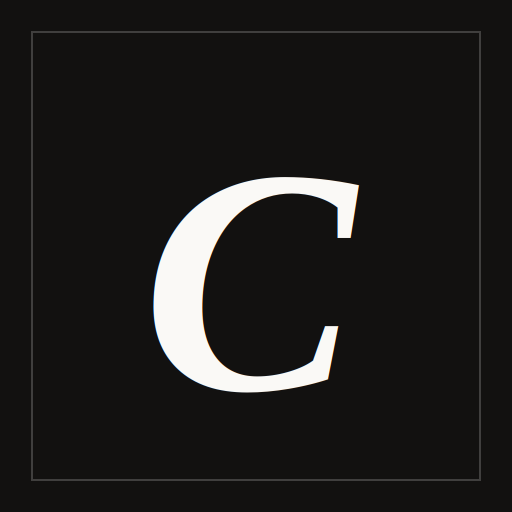

<div align="center">
  
  <h1>🎧 Coda Web Music</h1>
  <p><strong>A High-End, Minimalist Web Audio Player</strong></p>
  <p>Crafted with passion by <b>Safe_rill</b></p>
</div>

---

## 🌟 Overview

**Coda** adalah platform *streaming* musik berbasis web yang dirancang dengan estetika *High-End Editorial*. Terinspirasi dari majalah fesyen premium dan galeri seni, aplikasi ini meninggalkan desain generik aplikasi musik pada umumnya demi memberikan pengalaman visual yang minimalis, elegan, dan *cinematic*.

Proyek ini menggunakan **Next.js App Router** untuk memastikan pemutar musik (Player) tetap hidup secara global di latar belakang tanpa terputus saat pengguna berpindah-pindah halaman.

## ✨ Key Features

- **🖼️ High-End Editorial Design**: Menggunakan tipografi serif (*Playfair Display*), tata letak asimetris, garis batas tipis (thin borders), dan palet warna *espresso/cream/minimalist* untuk nuansa yang mewah.
- **🛡️ Spotify-Level Stability**: Menggunakan arsitektur *Global App Layout* dan *Global Error Boundary*, pemutar musik tidak akan pernah mati meskipun halaman lain mengalami kegagalan proses.
- **📱 Background Mobile Playback**: Menggunakan trik *Silent Audio Lock* (HTML5 Audio Base64), lagu akan terus diputar dengan stabil di Android/iOS meskipun layar dikunci atau browser diminimalkan.
- **⚡ Optimistic Load Bypass**: Pengalaman perpindahan lagu secepat kilat. Sistem akan langsung memuat ID lagu selanjutnya secara sinkron tanpa menunggu siklus render React yang lambat.
- **🧠 Smart State Persistence**: Menggunakan *Zustand Persist*, sesi pemutaran Anda (lagu saat ini, *queue*, dan *history*) akan selalu diingat. Refresh halaman atau tutup browser, dan lanjutkan tepat dari titik terakhir Anda mendengarkan.
- **🎬 Cinematic Splash Screen**: Pengunjung akan disambut oleh *Welcome Pop-up* bergaya mewah.
- **🖼️ High-Res Image Proxy**: Semua *thumbnail* album diambil secara *high-res* dan di-*proxy* dengan mulus melalui server Next.js.
- **📱 PWA Ready**: Aplikasi ini mendukung *Progressive Web App* (PWA) sehingga bisa diinstal layaknya aplikasi native di HP maupun PC Anda.

## 🛠️ Tech Stack

- **Framework**: [Next.js 15](https://nextjs.org/) (App Router)
- **Language**: [TypeScript](https://www.typescriptlang.org/)
- **Styling**: [Tailwind CSS](https://tailwindcss.com/)
- **State Management**: [Zustand](https://github.com/pmndrs/zustand)
- **Animations**: [Motion React (Framer Motion)](https://motion.dev/)
- **Audio Engine**: `react-youtube` (Iframe API)

## 🚀 Getting Started

Ikuti langkah-langkah berikut untuk menjalankan aplikasi ini secara lokal di mesin Anda.

### Prerequisites
Pastikan Anda sudah menginstal Node.js versi 18 ke atas.

### Installation

1. Clone repository ini:
   ```bash
   git clone https://github.com/saferill/Coda.git
   cd Coda
   ```

2. Instal dependensi:
   ```bash
   npm install
   ```

3. Jalankan server *development*:
   ```bash
   npm run dev
   ```

4. Buka [http://localhost:3000](http://localhost:3000) di browser favorit Anda.

## 🤝 Contributing

Jika Anda menemukan *bug* atau memiliki ide untuk meningkatkan fitur di dalam Coda, jangan ragu untuk membuat *Pull Request* atau membuka *Issue*.

## 📄 License

Proyek ini dibuat untuk tujuan pembelajaran dan portofolio pribadi. Seluruh hak cipta musik dan gambar tetap menjadi milik pencipta aslinya.
